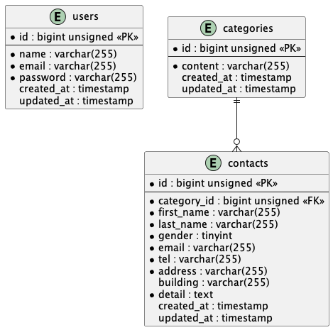

# FashionablyLate

## 環境構築

### Dockerビルド

```bash
git clone git@github-private:{リポジトリ名}.git
docker-compose up -d --build
```

### Laravel環境構築

```bash
docker-compose exec php bash
composer install
cp .env.example .env
php artisan key:generate
php artisan migrate
php artisan db:seed
```

※ `.env` の環境変数は適宜変更してください。

## 開発環境

- お問い合わせ画面：http://localhost/
- ユーザー登録：http://localhost/register
- ログイン：http://localhost/login
- 管理画面：http://localhost/admin
- phpMyAdmin：http://localhost:8080/

## 使用技術（実行環境）

- PHP 8.1
- Laravel 8.83.29
- MySQL 8.0.45
- nginx 1.21.1

## ER図


